import "./images.css"

## Elements 

1. **Container:** The window that contains the entire ChatBot experience and all of its components.
1. **Header:** A persistent region at the top of the ChatBot window that contains navigation, branding, and actions.
1. **Navigation:** A menu that contains navigational options, including access to the conversation history.
1. **Options menu:** Contains display options (more details in the [ChatBot variations section](#variations)) and other settings (more details in the [ChatBOt settings and preferences section](#chatbot-settings-and-preferences)).
1. **Messages:** Elements of the conversation between a ChatBot and user. More details can be found in the [message guidelines](#messages).
1. **Attachments:** Details about files that a user has uploaded to the ChatBot.
1. **Footer:** A persistent region at the bottom of the ChatBot window that contains the message bar and the footnote.
1. **Footnote (optional):** A persistent, short message that contains any legal disclaimers or important information about the ChatBot. Footnotes are optional, but strongly recommended. More details can be found in the [footnote guidelines](#footnotes).
1. **Toggle:** The button that allows users to open and close the ChatBot window. When the ChatBot is opened, the toggle should appear below the ChatBot window. The toggle shape and icon can be customized as needed, as shown in these [ChatBot toggle examples](/patternfly-ai/chatbot/ui#custom-toggle-icon). More details can be found in the [guidelines for accessing a ChatBot](#accessing-a-chatbot).

### Messages

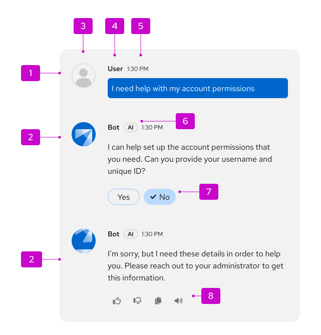

1. **User message:** Messages that the user has sent to the ChatBot.
1. **Bot message:** Messages from the ChatBot, which are marked with an "AI" label to communicate the use of AI to users. You should choose a descriptive name for your ChatBot.
1. **Avatar:** Representative image for your ChatBot and the user. ChatBot avatars should align with your product's brand and any existing brand standards.
1. **Name:** Identifier for your ChatBot and the user. Choose a name for your ChatBot that users can easily identify as a bot.
1. **Timestamp:** The relative or absolute time that a message was sent.
1. **Label:** Labels ChatBot messages as "AI."
1. **Quick responses:** Programmable, clickable actions that allow users to quickly answer questions from the ChatBot.
1. **Response actions:** Actions that allow users to interact with a bot message. these typically include providing feedback, copying, sharing, or reading aloud, but [custom message actions](/patternfly-ai/chatbot/messages#custom-message-actions) are also supported.

#### Source tiles

A ChatBot can share relevant sources with users, like documentation that could provide the information a user is searching for. These sources will be contained in a single tile, which users can paginate through and select to navigate to other resources. 

To provide users with enough context, sources should have descriptive titles and descriptions. The title is limited to 1 line and the body is limited to 2 lines.

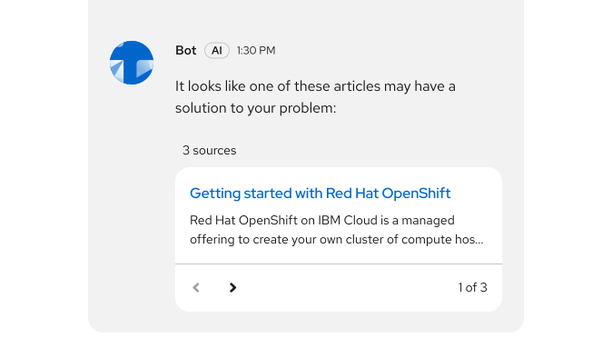

#### Quick start tiles

A ChatBot can share a link to a [quick start](/extensions/quick-starts) that will help users complete a given task. Users can either select **Start** or the tile's title to initiate the linked quick start.

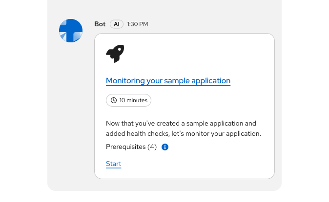

### Message bar

To message the ChatBot, users can type directly into the message bar in the footer or click any included actions.

1. **Attach button:** Allows users to upload files from their computer.
1. **Use microphone button:** Supports speech recognition to allow users to use voice input. This feature is currently only available in Chrome and Safari.
1. **Send button:** Allows users to send a typed message. This button should be disabled until a user has input text.

When a user chooses to use speech input via the microphone button, the button will display an animation to indicate that the ChatBot is listening to the user (as shown in [this speech recognition example](/patternfly-ai/chatbot/ui#message-bar-with-speech-recognition-and-file-attachment)).

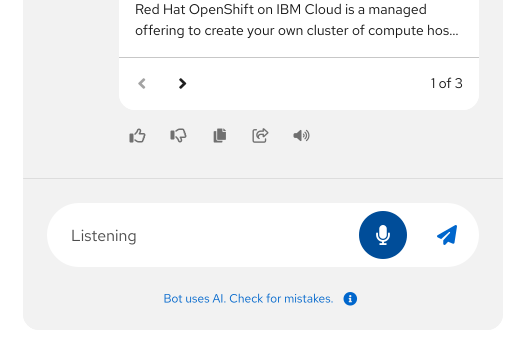

When a bot is responding (or "streaming") to the user, a stop button will be displayed as the only action in the message bar. Selecting this button will halt the bot's message where it's at.

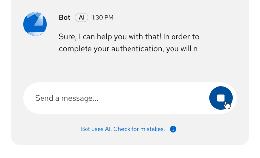

### Footnotes

The footnote provides a persistent space to display messaging about your product's Terms and Conditions, which focus on the rules of using the service, and Privacy Policy, which focuses on the handling of personal data.

Though footnotes are not required, they are highly recommended to ensure legal compliance, establish user trust, and clearly define the usage guidelines and data handling practices.

When users select the footnote, you can display a popover that provides more information than would fit in the footnote:

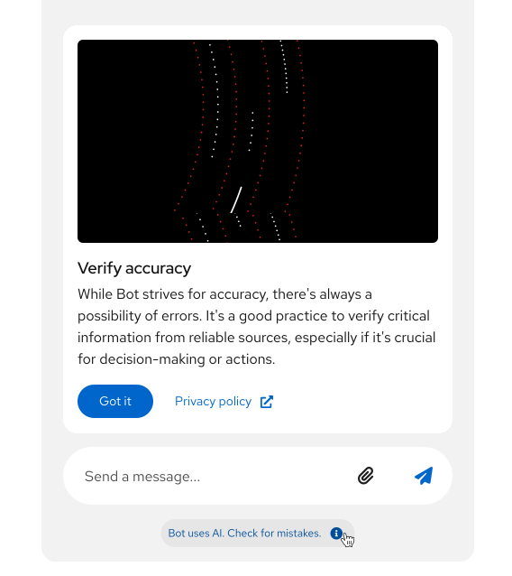

## Usage

When ChatBots are designed to meet the needs of your users, they can improve the overall UX of your product by offering convenient, efficient, and persistent support. When your ChatBot cannot find an answer for your users, you must provide them with a method to contact human support.

Before building a ChatBot, make sure that you have justified it as an appropriate solution by asking yourself these questions:

- What are the users’ goals?
- How in-depth is the assistance the user will need?
- Does human assistance better serve your users?
- How is a ChatBot superior to online documentation, contextual support or wizards?
- What data sources or abilities can this ChatBot leverage to assist your users?

Do not create a ChatBot simply for the sake of novelty.

### When to use a ChatBot

Use a ChatBot to offer your users on-demand help at any time, including:

- Technical support and troubleshooting.
- Product information and documentation.
- Sales and product recommendations.
- Training and onboarding.
- System monitoring and alerts.
- Community engagement.
- Feedback collection and surveys.

### When not to use a ChatBot

Do not use a ChatBot when:

- A task could be accomplished more efficiently through the UI.
- A process is very complex or could take a long time.
- A real human is needed for sensitive or emotional topics.

## Behavior

### Accessing a ChatBot

Users can enter a conversation with a ChatBot by clicking on the toggle. Once the ChatBot window opens, the toggle will change to display an "angle down" icon to indicate that clicking the toggle again will minimize the ChatBot. Users can select the toggle at any point in their journey to open and close the ChatBot as needed.

When there is an unread message from the ChatBot, a notification badge should be placed on the toggle.

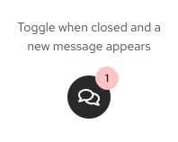

If necessary for brand consistency, you can customize the toggle shape and icon.

### Using the navigation menu

The ChatBot navigation menu primarily contains a users' conversation history with the ChatBot. Clicking the menu icon opens a side drawer in the ChatBot window.

By clicking into the navigation menu, users can search through previous conversations and perform additional actions, such as sharing a conversation with others.

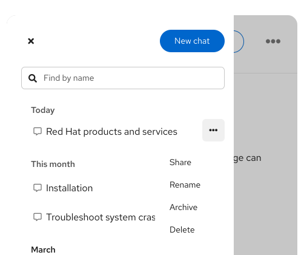

### ChatBot settings and preferences

Users can access ChatBot settings and preferences via the options menu.

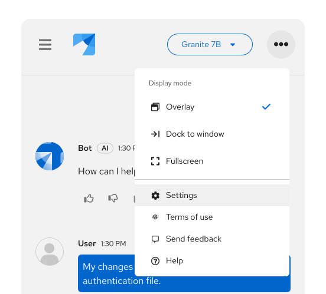

Within the settings menu, users can select their preferences for a variety of ChatBot features, like theme or language. You can also support additional content management here, like adding or deleting chats. This menu can be customized to meet the needs of your ChatBot's users.

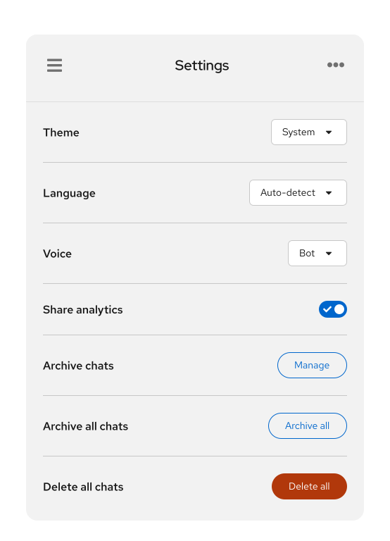

### Attaching files

Using [the attach button](/patternfly-ai/chatbot/overview/design-guidelines#message-bar) in the message bar, users can [attach files](/patternfly-ai/chatbot/messages#file-attachments) to their message to share with the ChatBot.

The attach button can follow a couple of patterns, including:

- Opening the file explorer for a user's operating system
- Opening a menu with attachment options that are chosen by designers and developers

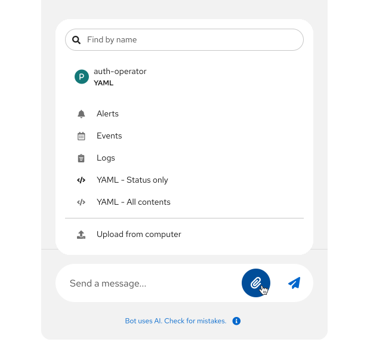

When users attach a file to a message that they're drafting, it will be displayed in the ChatBot footer, above the message bar. This allows them to remove an attachment before sending if necessary:

If a message attachment is successful, a label with the file details will be displayed in the message:

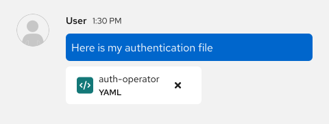

Users can select the file label to either preview or edit their attachment, as shown in these [attachment examples](/patternfly-ai/chatbot/messages#attachment-preview).

If a message attachment fails, an error message should share the reason for failure:

## Variations

### Display modes

There are a few display modes that users can choose when interacting with a ChatBot.

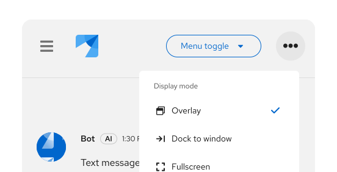

1. **Overlay:** The default display mode, which floats the ChatBot window on top of a product's UI. In overlay mode, the ChatBot can be opened and minimized with the toggle.

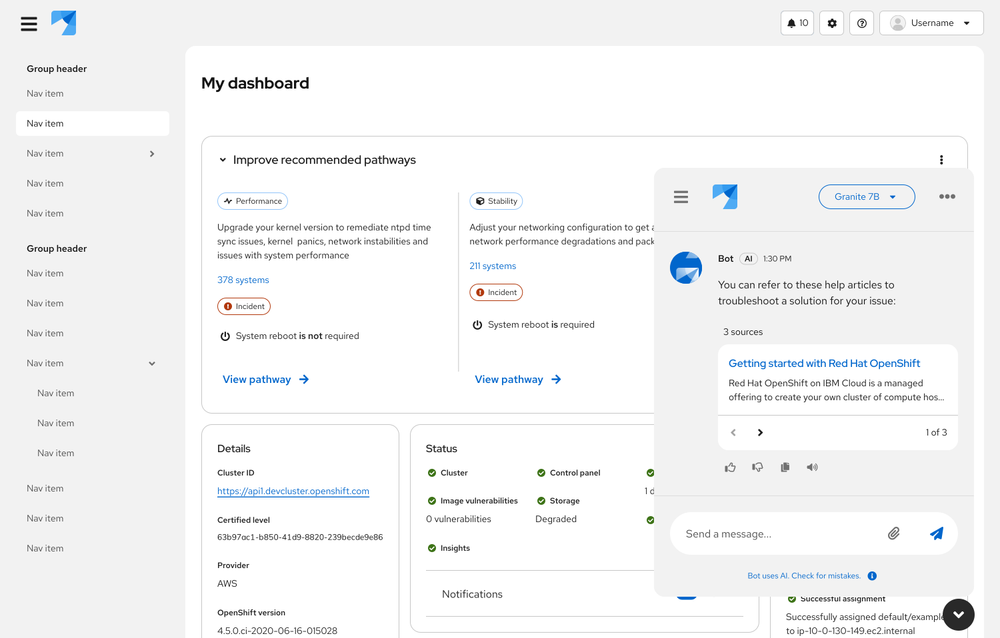

2. **Docked:** Anchors the ChatBot to the side of the page content. When docked, the ChatBot window is persistent, and cannot be toggled.

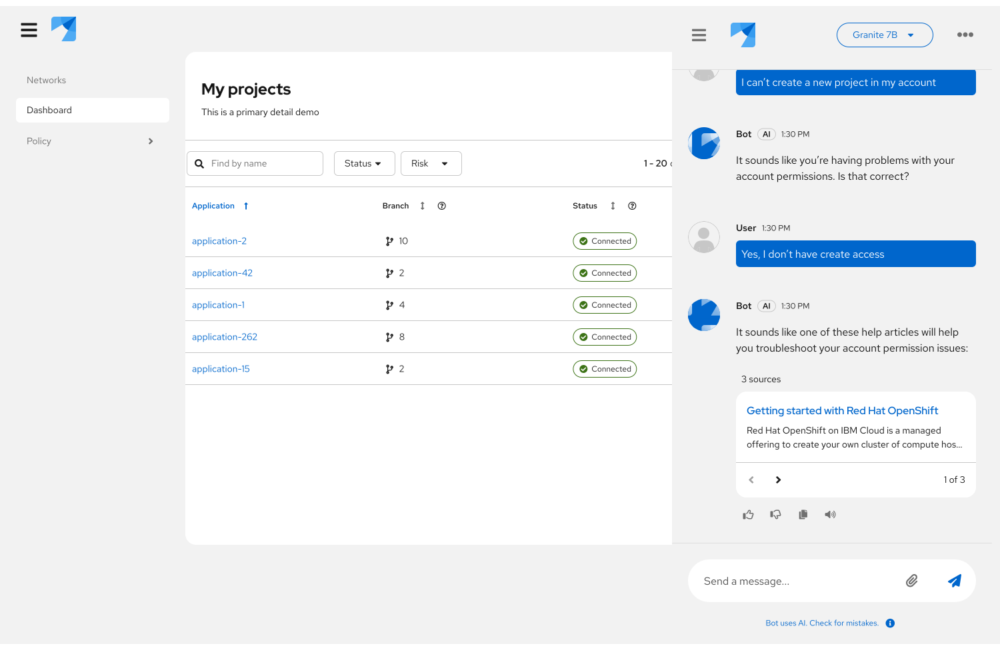

3. **Full screen:** Fills the screen with the ChatBot window.

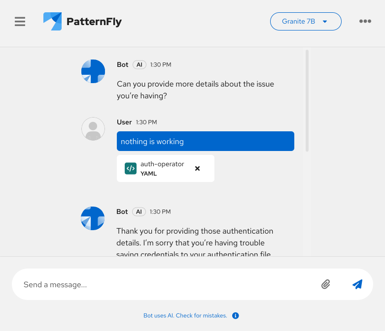

4. **Embedded:** Places the ChatBot within a product as its own page. An embedded ChatBot could be displayed in the product's navigation menu.

## Placement

Your users will expect your ChatBot to be in a reliable, permanent location. Overlay displays are placed in the bottom right of the screen by default. If you're using a full screen or embedded ChatBot, stick to a consistent access location, like a button in the masthead or an item in the navigation menu.

## Content considerations

For guidance on writing ChatBot content, refer to our [conversation design guidelines](/patternfly-ai/conversation-design).

## Accessibility

Although accessibility has been integrated into the design of our ChatBot components, it is important to ensure that your implementation is inclusive of all users. For more guidance, refer to [our accessibility guidelines](/accessibility/about-accessibility).
